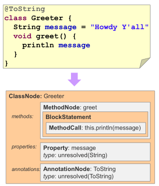

# groovy258-ast-compile-time-metaprogramming-workshop

* references
    * http://notatube.blogspot.com/2010/12/project-lombok-creating-custom.html
    * https://en.wikipedia.org/wiki/Abstract_syntax_tree
    * https://groovy-lang.org/metaprogramming.html#_compile_time_metaprogramming
    * https://www.youtube.com/watch?v=hLBahy6lPWI
    * https://www.slideshare.net/SpringCentral/groovy-asttransforms-paulkingsep2014
    * http://melix.github.io/ast-workshop/
    * https://eli.thegreenplace.net/2009/02/16/abstract-vs-concrete-syntax-trees
    * http://emmanuelrosa.com/articles/how-to-create-your-first-groovy-ast-transformation/

## preface
* goals of this workshop:
    * AST, CST definitions
    * groovy AST transformations
    * java AST transformations (lombok digression)
* workshop: `workshop` package, answers: `answers` package

## project 
* overview of groovy AST transformations API
* https://github.com/mtumilowicz/java-annotations-retention-policy
* in short, we will always extend `AbstractASTTransformation` and implement:
    ```
    void visit(ASTNode nodes[], SourceUnit source);
    ```
    * method is invoked when an AST Transformation is active
    * for local transformations, it is invoked once each time the local annotation is encountered
    * for global transformations, it is invoked once for every source unit, which is typically a source file
    * `ASTnodes nodes[]`
        * `node[0]` is the `AnnotationNode` that triggered this annotation to be activated
        * `node[1]` is the `AnnotatedNode` decorated, such as a `FieldNode`, `ImportNode`, `ClassNode`, `MethodeNode` 
        and others: http://docs.groovy-lang.org/latest/html/api/org/codehaus/groovy/ast/AnnotatedNode.html
     * `SourceUnit source` - source unit being compiled - may contain several classes
    
## Abstract Syntax Tree (AST) 
* is a tree representation of the abstract syntactic structure of source code written in a programming language
* each node of the tree denotes a construct occurring in the source code
* does not represent every detail appearing in the real syntax - just the structural or content-related 
details (therefore - abstract)
    * grouping parentheses are implicit in the tree structure
    * syntactic construct like an if-condition-then expression may be denoted by means of a single node with 
    three branches
* semantic analysis or context sensitive analysis is a process in compiler construction, usually after parsing, to 
    gather necessary semantic information from the source code
    * usually includes type checking, or makes sure a variable is declared before use
* has several properties that aid the further steps of the compilation process:
    * AST can be easily edited and enhanced with information
        * such editing is often very hard or even impossible with the source code of a program
    * compared to the source code, an AST does not include inessential punctuation and delimiters
    * an AST usually contains extra information about the program, due to the consecutive stages of analysis by the 
    compiler
        * example - it may store the position of each element in the source code, allowing the compiler to print 
    useful error messages
    
### AST vs CST
* CST is a one-to-one mapping from the grammar to a tree-form
* `return a + 2`
    * CST
        
    * AST
        

## compile-time metaprogramming
* Compile-time metaprogramming in Groovy allows code generation at compile-time.
* Those transformations are altering the Abstract Syntax Tree (AST) of a program, which is why in Groovy we call it 
AST transformations. 
* AST transformations allow you to hook into the compilation process, modify the AST and 
continue the compilation process to generate regular bytecode.
* Compared to runtime metaprogramming, this has the advantage of making the changes visible in the class file itself 
(that is to say, in the bytecode)
    * For example, an AST transformation can add methods to a class.
* AST transformations can be separated into two categories:
    * global AST transformations are applied transparently, globally, as soon as they are found on compile classpath
    * local AST transformations are applied by annotating the source code with markers
* example

    * very similar to JAVA (but not exact)
* compiler
    * **Early stages**: read source code and convert into a sparse syntax tree
        
        * compiler doesn't care if class is on a classpath
        * `unresolved(String)` - at this point we doesn't know what `String` means
        * phases:
            * **Initialization**
                * read source files/streams and configure compiler
                * key classes: `CompilerConfiguration` (classpath, warning levels, jdk), `CompilationUnit` (we could 
                add additional source units to the compilation)
            * **Parsing**
                * use (ANTLR) grammar to convert source code into token tree (concrete syntax tree - CST)
                    * https://github.com/groovy/groovy-core/tree/master/src/main/org/codehaus/groovy/antlr
                * key classes: `CompilationUnit`, `GroovyLexer`, `GroovyRecognizer`, `GroovyTokenTypes`
            * **Conversion**
                * CST -> AST
                * first place to write AST visitors
                * key classes: `AntlrParserPlugin`, `EnumVisitor`
    * **Middle stages**: iteratively build up a more dense and information rich version of the syntax tree
        
        * checks if a class is on the classpath
        * phases:
            * **Semantic Analysis**: resolves classes and performs consistency and validity checks beyond what the 
            grammar can provide
                * key classes: `StaticVerifier` (check non-static access in static contexts), `ResolveVisitor`(try to 
                find the `Class` for a `ClassExpression` and prints an error if it fails to do so), 
                `StaticImportVisitor`, `InnerClassVisitor`, `AnnotationCollector` (used with aliases)
                * transformations: `@Lazy`, `@Builder`, `@Field`, `@Log`, `@Memoized`, `@PackageScope`, 
                `@TailRecursive`, `@BaseScript`
            * **Canonicalization**: finalizes the complete abstract syntax tree
                * typically the last point at which you want to run a transformation
                * key classes: `InnerClassCompletionVisitor`, `EnumCompletionVisitor`, `TraitComposer` (generating code 
                for a classnode implementing a trait)
                * transformations: `@Category`, `@Delegate`, `@EqualsAndHashCode`, `@Immutable`, `@Sortable`, 
                `@WithReadLock`, `@WithWriteLock`, `@Singleton`, `@ToString`
            * **Instruction Selection**: adds the AST nodes which Groovy allows us to disregard, such as `return` 
            statements
                * chooses an instruction set for the generated bytecode, e.g. Java 8 versus pre-Java 8
                * transformations: `@CompileStatic`, `@TypeChecked`
    * **Later stages**: check the tree and convert it into byte code/class files
        
        * phases:
            * **Class Generation**: creates bytecode based classes in memory
                * Groovy adds methods such as `getMetaClass()` and `invokeMethod()`, and then builds the final class
                * key classes: `OptimizerVisitor` (produce several optimizations: replaces numbered constants with 
                references to static fields), `GenericsVisitor` (verifies correct usage of generics - invalid diamond 
                `<>` usage), `Verifier`(methods with duplicate signatures, reassigned final variables/parameters, 
                uninitialized variables, adds property accessor methods, adds methods/constructors as needed for 
                default parameters), `LabelVerifier`, `ExtendedVerifier`, 
                `ClassCompletionVerifier` (no abstract methods appear in a non-abstract class), `AsmClassGenerator` 
                (Java class versions of Groovy classes using ASM)
            * **Output**: binary output (`.class` file) written to file system
            * **Finalization**: compiler releases its resources
### lombok digression
* https://github.com/rzwitserloot/lombok/blob/master/src/core/lombok/AllArgsConstructor.java