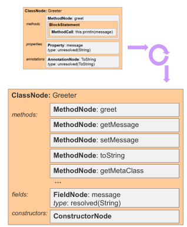

# groovy258-ast-compile-time-metaprogramming-workshop

* http://notatube.blogspot.com/2010/12/project-lombok-creating-custom.html
* https://en.wikipedia.org/wiki/Abstract_syntax_tree
* https://groovy-lang.org/metaprogramming.html#_compile_time_metaprogramming
* https://www.ibm.com/developerworks/library/j-lombok/j-lombok-pdf.pdf
* https://www.youtube.com/watch?v=hLBahy6lPWI
* https://www.slideshare.net/SpringCentral/groovy-asttransforms-paulkingsep2014
* http://melix.github.io/ast-workshop/
* https://github.com/rzwitserloot/lombok/tree/master/src/core/lombok
    * https://github.com/rzwitserloot/lombok/tree/master/src/core/lombok/core
    * https://github.com/rzwitserloot/lombok/blob/master/src/core/lombok/AllArgsConstructor.java
    * https://github.com/rzwitserloot/lombok/blob/master/src/core/lombok/javac/handlers/HandleConstructor.java
* https://github.com/groovy/groovy-core/blob/master/src/main/org/codehaus/groovy/transform/LogASTTransformation.java
* https://eli.thegreenplace.net/2009/02/16/abstract-vs-concrete-syntax-trees

    /**
     * The method is invoked when an AST Transformation is active. For local transformations, it is invoked once
     * each time the local annotation is encountered. For global transformations, it is invoked once for every source
     * unit, which is typically a source file.
     *
     * @param nodes The ASTnodes when the call was triggered. Element 0 is the AnnotationNode that triggered this
     *      annotation to be activated. Element 1 is the AnnotatedNode decorated, such as a MethodNode or ClassNode. For
     *      global transformations it is usually safe to ignore this parameter.
     * @param source The source unit being compiled. The source unit may contain several classes. For global transformations,
     *      information about the AST can be retrieved from this object. 
     */
    void visit(ASTNode nodes[], SourceUnit source);
    
    https://github.com/mtumilowicz/java-annotations-retention-policy
    
    ```
    while b ≠ 0
      if a > b
        a := a − b
      else
        b := b − a
    return a
    ```
    

# Abstract Syntax Tree (AST) 
* is a tree representation of the abstract syntactic structure of source code written in a programming language
* each node of the tree denotes a construct occurring in the source code
* does not represent every detail appearing in the real syntax, but rather just the structural or content-related 
details (abstract)
    * grouping parentheses are implicit in the tree structure, so these do not have to be represented as 
    separate nodes
    * syntactic construct like an if-condition-then expression may be denoted by means of a single node with 
    three branches
* semantic analysis or context sensitive analysis is a process in compiler construction, usually after parsing, to 
    gather necessary semantic information from the source code
    * usually includes type checking, or makes sure a variable is declared before use
* data structures widely used in compilers to represent the structure of program code
* is usually the result of the syntax analysis phase of a compiler
* has several properties that aid the further steps of the compilation process:
    * An AST can be edited and enhanced with information such as properties and annotations for every element it 
    contains. Such editing and annotation is impossible with the source code of a program, since it would imply 
    changing it.
    * Compared to the source code, an AST does not include inessential punctuation and delimiters (braces, semicolons, 
    parentheses, etc.).
    * An AST usually contains extra information about the program, due to the consecutive stages of analysis by the 
    compiler. For example, it may store the position of each element in the source code, allowing the compiler to print 
    useful error messages.
# AST vs CST
* CST is a one-to-one mapping from the grammar to a tree-form
* `return a + 2`
    * CST
        
    * AST
        

# compile-time metaprogramming
* Compile-time metaprogramming in Groovy allows code generation at compile-time.
* Those transformations are altering the Abstract Syntax Tree (AST) of a program, which is why in Groovy we call it 
AST transformations. 
* AST transformations allow you to hook into the compilation process, modify the AST and 
continue the compilation process to generate regular bytecode.
* Compared to runtime metaprogramming, this has the advantage of making the changes visible in the class file itself 
(that is to say, in the bytecode)
    * For example, an AST transformation can add methods to a class.
* AST transformations can be separated into two categories:
    * global AST transformations are applied transparently, globally, as soon as they are found on compile classpath
    * local AST transformations are applied by annotating the source code with markers
* example

    * very similar to JAVA (but not exact)
* compiler
    * **Early stages**: read source code and convert into a sparse syntax tree
        
        * compiler doesn't care if class is on a classpath
        * `unresolved(String)` - at this point we doesn't know what `String` means
        * phases:
            * **Initialization**
                * read source files/streams and configure compiler
                * key classes: `CompilerConfiguration` (classpath, warning levels, jdk), `CompilationUnit` (we could 
                add additional source units to the compilation)
            * **Parsing**
                * use (ANTLR) grammar to convert source code into token tree (concrete syntax tree - CST)
                    * https://github.com/groovy/groovy-core/tree/master/src/main/org/codehaus/groovy/antlr
                * key classes: `CompilationUnit`, `GroovyLexer`, `GroovyRecognizer`, `GroovyTokenTypes`
            * **Conversion**
                * CST -> AST
                * first place to write AST visitors
                * key classes: `AntlrParserPlugin`, `EnumVisitor`
    * **Middle stages**: iteratively build up a more dense and information rich version of the syntax tree
        
        * checks if a class is on the classpath
        * phases:
            * **Semantic Analysis**
            * **Canonicalization**
            * **Instruction Selection**
    * **Later stages**: check the tree and convert it into byte code/class files
        
        * checks what java we use and style bytecode (`invokedynamic` since java 7)
* defined transformations
    * EqualsAndHashCode - remember that for comparing references in groovy x.is y
        * should be defined all down the structure
    * @Lazy - understands double checked-locking
        * http://docs.groovy-lang.org/docs/groovy-2.4.9/html/gapi/groovy/lang/Lazy.html
    * @Singleton - http://docs.groovy-lang.org/latest/html/api/groovy/lang/Singleton.html
    * @Sortable
        * `*` operator
    * @Builder
    * @CompileStatic
    * @Delegate
    * @Memoized
    * @Immutable - recursive
    * @TailRecursive - use trampoline
        * slide 40
    * @Log, @Log4j
    * WithReadLock, WithWriteLock
# lombok digression